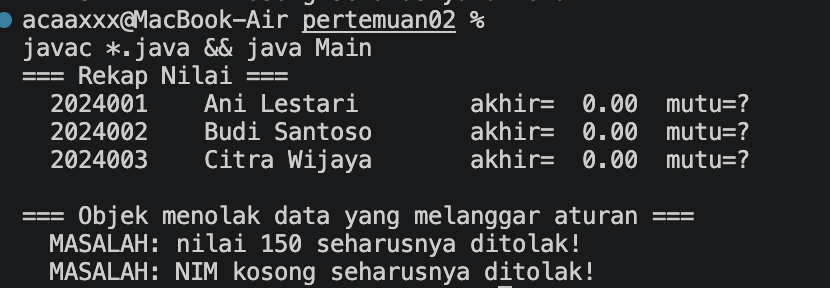
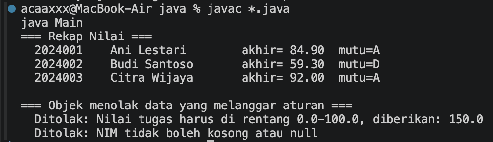
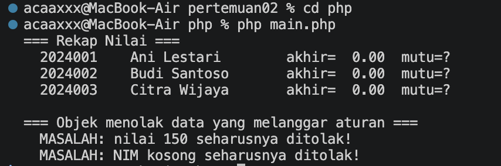
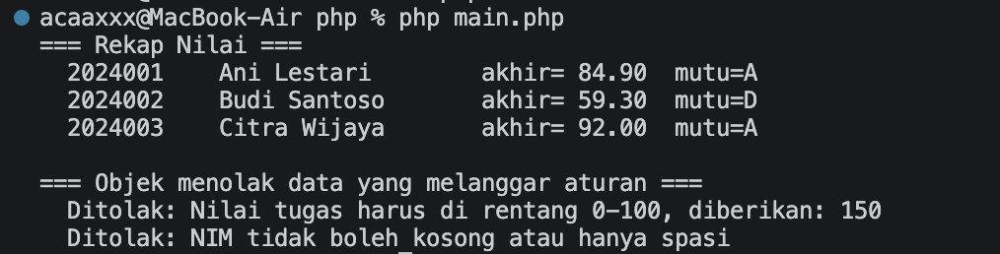

# Praktikum 02 — Kelas, Objek, dan Enkapsulasi

**Nama:** Muhamad Rasha Zein  
**NPM:** 4525210042  
**Kelas:** PBO A 2025/2026  
**Dosen Pengampu:** Adi Wahyu Pribadi, S.Si., M.Kom

## File Mahasiswa.java

### Sebelum

[Lihat kode Mahasiswa.java sebelum](../../Materi-Pembelajaran&Codingan-sebelumdibenerin/codingansebelum/pertemuan02/java/Mahasiswa.java).

**Tugas:** menjaga NIM dan nama agar tidak berubah, memvalidasi nilai 0–100, menghitung nilai akhir dengan bobot, dan menentukan huruf mutu. Versi sebelum belum menghitung nilai dan belum menolak data yang tidak sah.

### Setelah

[Lihat kode Mahasiswa.java setelah](src/java/Mahasiswa.java).

NIM dan nama dibuat tetap, nilai divalidasi saat objek dibuat, dan nilai akhir serta huruf mutu dihitung sesuai aturan.

## File Mahasiswa.php

### Sebelum

[Lihat kode Mahasiswa.php sebelum](../../Materi-Pembelajaran&Codingan-sebelumdibenerin/codingansebelum/pertemuan02/php/Mahasiswa.php).

**Tugas:** menerapkan enkapsulasi, validasi nilai, perhitungan nilai akhir, dan huruf mutu seperti pada Java.

### Setelah

[Lihat kode Mahasiswa.php setelah](src/php/Mahasiswa.php).

PHP menggunakan properti `readonly`, validasi rentang nilai, dan perhitungan dengan konstanta bobot.

## Hasil keseluruhan

### Java — sebelum

### Java — setelah

### PHP — sebelum

### PHP — setelah

### Kesimpulan

Setelah perbaikan, kedua program menghasilkan nilai akhir dan huruf mutu, serta menolak nilai di luar rentang dan NIM kosong.
