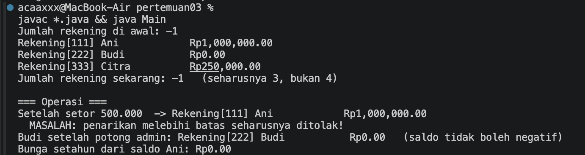
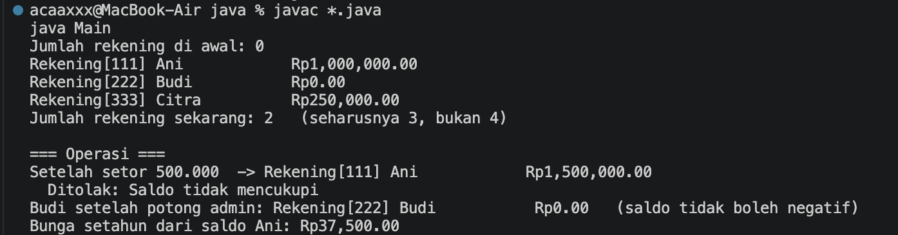
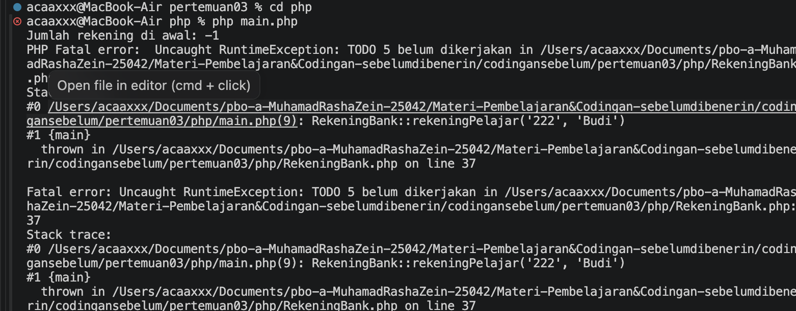
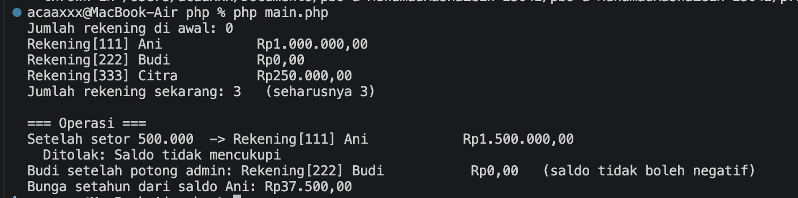

# Praktikum 03 — Constructor, Anggota Statis, dan Konstanta

**Nama:** Muhamad Rasha Zein  
**NPM:** 4525210042  
**Kelas:** PBO A 2025/2026  
**Dosen Pengampu:** Adi Wahyu Pribadi, S.Si., M.Kom

## File RekeningBank.java

### Sebelum

[Lihat kode RekeningBank.java sebelum](../../Materi-Pembelajaran&Codingan-sebelumdibenerin/codingansebelum/pertemuan03/java/RekeningBank.java).

**Tugas:** melengkapi konstanta, penghitung rekening, delegasi constructor, validasi saldo dan transaksi, biaya administrasi, serta perhitungan bunga. Versi sebelum masih memiliki bagian TODO dan hasil penghitung yang tidak sesuai.

### Setelah

[Lihat kode RekeningBank.java setelah](src/java/RekeningBank.java).

Constructor dan operasi rekening dilengkapi dengan validasi serta konstanta. Constructor ringkas dibuat dengan delegasi ke constructor lengkap.

## File RekeningBank.php

### Sebelum

[Lihat kode RekeningBank.php sebelum](../../Materi-Pembelajaran&Codingan-sebelumdibenerin/codingansebelum/pertemuan03/php/RekeningBank.php).

**Tugas:** membuat padanan pengelolaan rekening di PHP, termasuk validasi, penghitung statis, dan operasi setoran/penarikan.

### Setelah

[Lihat kode RekeningBank.php setelah](src/php/RekeningBank.php).

Implementasi PHP menggunakan constructor dengan saldo awal opsional, named constructor, validasi transaksi, serta konstanta dan method statis.

## Hasil keseluruhan

### Java — sebelum

### Java — setelah

### PHP — sebelum

### PHP — setelah

### Kesimpulan

Versi PHP membuat tiga rekening dan menjalankan operasi sesuai aturan. Pada hasil Java setelah, penghitung masih menunjukkan 2, bukan 3; tangkapan layar mencatat keluaran program yang tersedia.
