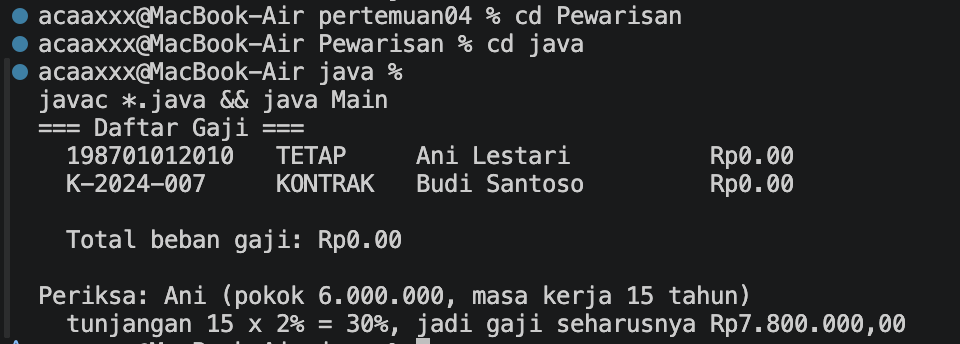
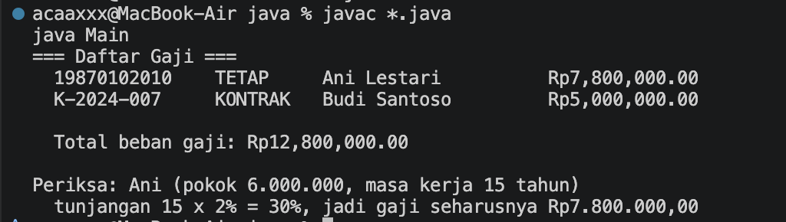
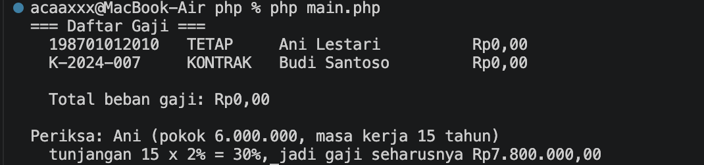
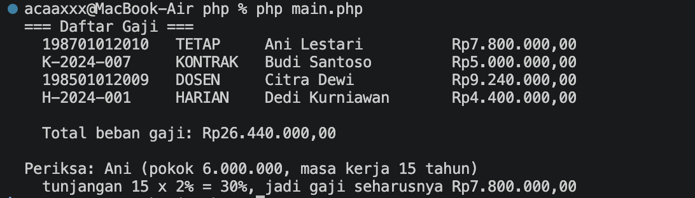

# Praktikum 04 — Pewarisan (Inheritance)

**Nama:** Muhamad Rasha Zein  
**NPM:** 4525210042  
**Kelas:** PBO A 2025/2026  
**Dosen Pengampu:** Adi Wahyu Pribadi, S.Si., M.Kom

## File PegawaiTetap.java

### Sebelum

[Lihat kode PegawaiTetap.java sebelum](../../Materi-Pembelajaran&Codingan-sebelumdibenerin/codingansebelum/pertemuan04/Pewarisan/java/PegawaiTetap.java).

**Tugas:** menerapkan pewarisan dari `Pegawai`, menggunakan `super` untuk meneruskan data ke constructor induk, dan menghitung tunjangan masa kerja sebesar 2% per tahun dengan batas maksimum 40%.

### Setelah

[Lihat kode PegawaiTetap.java setelah](src/java/PegawaiTetap.java).

Constructor memanggil constructor induk, sedangkan perhitungan gaji memakai `super.hitungGaji()` sebagai gaji dasar lalu menambahkan tunjangan masa kerja.

## File Pegawai.php

### Sebelum

[Lihat kode Pegawai.php sebelum](../../Materi-Pembelajaran&Codingan-sebelumdibenerin/codingansebelum/pertemuan04/Pewarisan/php/Pegawai.php).

**Tugas:** membuat hierarki pegawai dan menerapkan perhitungan gaji untuk pegawai tetap, kontrak, dosen, dan pegawai harian.

### Setelah

[Lihat kode Pegawai.php setelah](src/php/Pegawai.php).

PHP memuat kelas abstrak `Pegawai` dan turunannya. Gaji tetap memakai tunjangan masa kerja, dosen memperoleh tunjangan fungsional, dan pegawai harian dihitung berdasarkan hari kerja.

## Hasil keseluruhan

### Java — sebelum

### Java — setelah

### PHP — sebelum

### PHP — setelah

### Kesimpulan

Pewarisan memungkinkan kelas turunan menggunakan data dan perilaku dasar dari induknya, lalu menambahkan aturan gaji khusus. Hasil setelah perbaikan menunjukkan perhitungan gaji tidak lagi bernilai nol.
