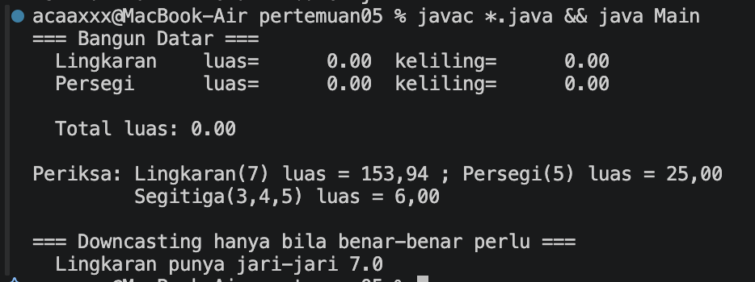
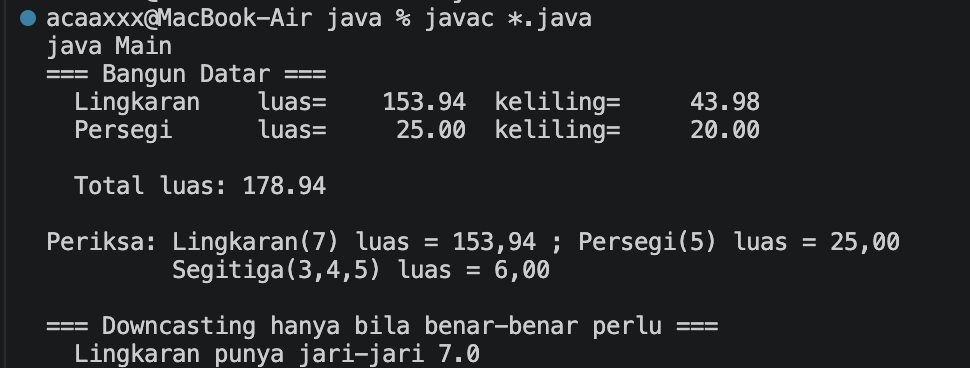
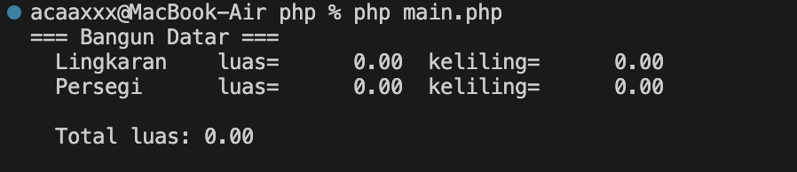
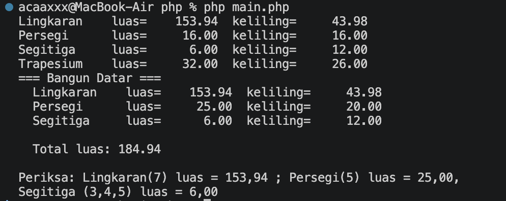

# Praktikum 05 — Polimorfisme

**Nama:** Muhamad Rasha Zein  
**NPM:** 4525210042  
**Kelas:** PBO A 2025/2026  
**Dosen Pengampu:** Adi Wahyu Pribadi, S.Si., M.Kom

## File Main.java

### Sebelum

[Lihat kode Main.java sebelum](../../Materi-Pembelajaran&Codingan-sebelumdibenerin/codingansebelum/pertemuan05/java/Main.java).

**Tugas:** memakai satu perulangan untuk memproses beragam bangun datar melalui tipe induk `BangunDatar`, serta menjumlahkan luasnya. Array perlu diisi dengan objek bangun yang diminta.

### Setelah

[Lihat kode Main.java setelah](src/java/Main.java).

Array dan perulangan menggunakan tipe abstrak `BangunDatar`, sehingga operasi luas dan keliling dijalankan secara polimorfik.

## File main.php

### Sebelum

[Lihat kode main.php sebelum](../../Materi-Pembelajaran&Codingan-sebelumdibenerin/codingansebelum/pertemuan05/php/main.php).

**Tugas:** memproses daftar bangun datar, menampilkan ukuran masing-masing, dan menjumlahkan luasnya.

### Setelah

[Lihat kode main.php setelah](src/php/main.php).

Daftar bangun diproses dengan tipe dasar `BangunDatar`; tiap objek menyediakan perhitungan luas dan kelilingnya sendiri.

## Hasil keseluruhan

### Java — sebelum

### Java — setelah

### PHP — sebelum

### PHP — setelah

### Kesimpulan

Polimorfisme memungkinkan daftar objek diproses melalui tipe induk tanpa memeriksa kelas konkret untuk setiap operasi. Pada hasil Java yang tersedia, daftar utama masih memuat lingkaran dan persegi, sedangkan hasil PHP juga menampilkan segitiga dan trapesium.
