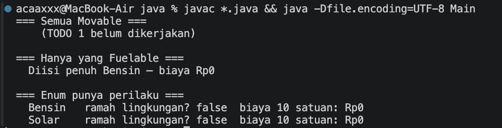
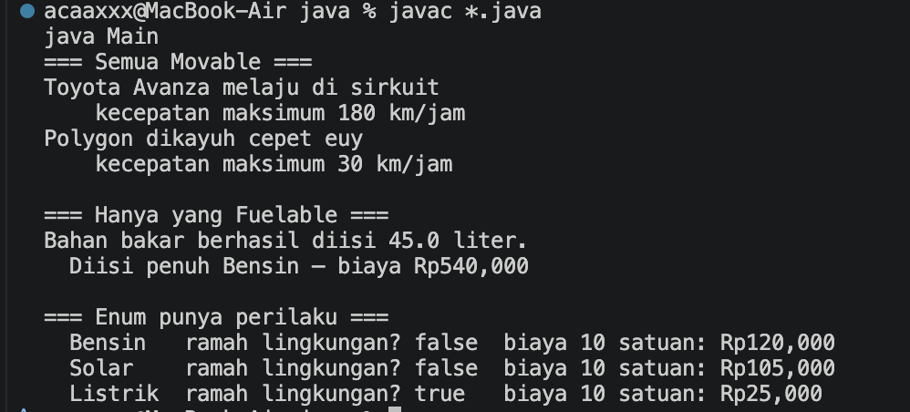
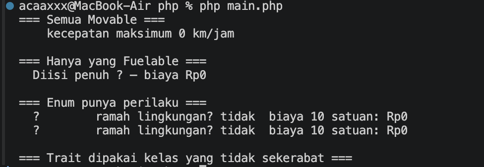
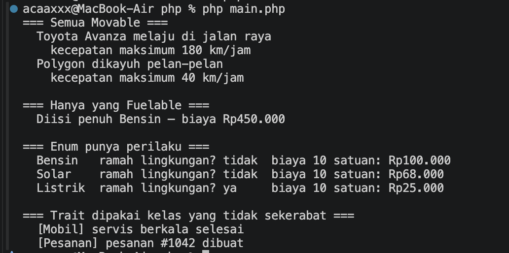

# Praktikum 06 — Abstract Class, Interface, Enum, dan Trait

**Nama:** Muhamad Rasha Zein  
**NPM:** 4525210042  
**Kelas:** PBO A 2025/2026  
**Dosen Pengampu:** Adi Wahyu Pribadi, S.Si., M.Kom

## File Mobil.java

### Sebelum

[Lihat kode Mobil.java sebelum](../../Materi-Pembelajaran&Codingan-sebelumdibenerin/codingansebelum/pertemuan06/06-abstract-class-interface-enum-dan-trait/starter/java/Mobil.java).

**Tugas:** melengkapi perilaku `Movable` dan `Fuelable`, termasuk gerak mobil, kecepatan maksimum, dan pengisian bahan bakar yang tidak boleh melebihi kapasitas tangki. Pada versi sebelum, bagian tersebut masih berupa TODO.

### Setelah

[Lihat kode Mobil.java setelah](src/java/Mobil.java).

Mobil menerapkan dua interface. Metode gerak menampilkan perilaku mobil, kecepatan maksimum mengembalikan 180 km/jam, dan pengisian bahan bakar memeriksa jumlah serta kapasitas tangki.

## File abstraksi.php

### Sebelum

[Lihat kode abstraksi.php sebelum](../../Materi-Pembelajaran&Codingan-sebelumdibenerin/codingansebelum/pertemuan06/06-abstract-class-interface-enum-dan-trait/starter/php/abstraksi.php).

**Tugas:** menerapkan abstract class, interface, enum dengan perilaku, serta trait yang dapat digunakan oleh kelas yang tidak sekerabat.

### Setelah

[Lihat kode abstraksi.php setelah](src/php/abstraksi.php).

Implementasi PHP menyediakan kontrak `Movable` dan `Fuelable`, enum biaya bahan bakar, serta trait `Loggable` untuk `Mobil` dan `Pesanan`.

## Hasil keseluruhan

### Java — sebelum

### Java — setelah

### PHP — sebelum

### PHP — setelah

### Kesimpulan

Interface memisahkan kemampuan kendaraan, abstract class menampung perilaku dasar, enum mengelola jenis bahan bakar, dan trait berbagi perilaku logging. Hasil setelah perbaikan menunjukkan perilaku gerak, pengisian bahan bakar, dan biaya yang sesuai implementasi.
